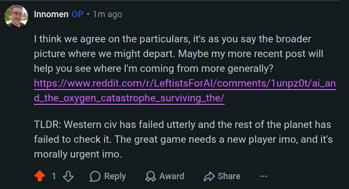

# Public Take transcript

## Machine transcription

’ Innomen OF « Tm ago

| think we agree on the particulars, it's as you say the broader
picture where we might depart. Maybe my more recent post will
help you see where I'm coming from more generally?
https://www.reddit.com/r/LeftistsForAl/comments/1unpz0t/ai_an
d_the_oxygen_catastrophe_surviving_the/

TLDR: Western civ has failed utterly and the rest of the planet has
failed to check it. The great game needs a new player imo, and it's
morally urgent imo.

418 OReply LQAward D Share
