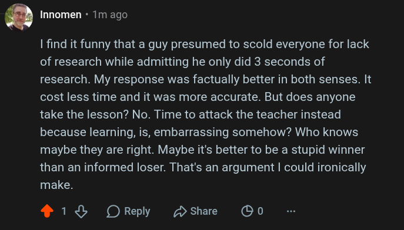

# Public Take transcript

## Machine transcription

O Innomen - Tm ago

1 find it funny that a guy presumed to scold everyone for lack
of research while admitting he only did 3 seconds of
research. My response was factually better in both senses. It
cost less time and it was more accurate. But does anyone
take the lesson? No. Time to attack the teacher instead
because learning, is, embarrassing somehow? Who knows
maybe they are right. Maybe it's better to be a stupid winner
than an informed loser. That's an argument | could ironically
make.

® 18 OReply shae @G0
