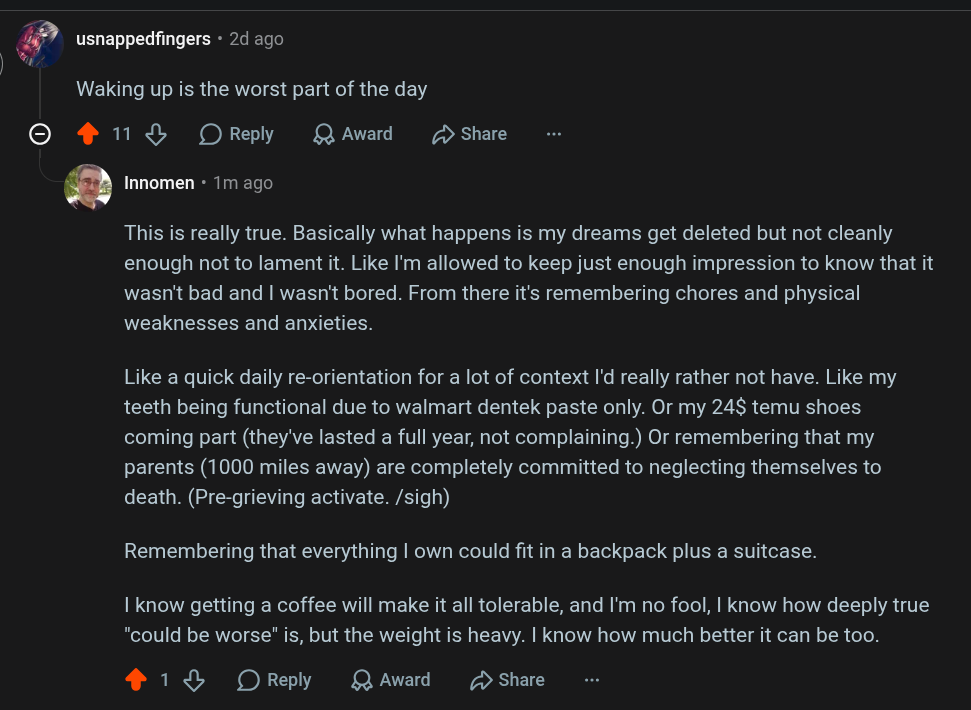

# Public Take transcript

## Machine transcription

"

\ m usnappedfingers - 2d ago

Waking up is the worst part of the day

O 411 % OReply QAward D Share

O Innomen - Tm ago

This is really true. Basically what happens is my dreams get deleted but not cleanly
enough not to lament it. Like I'm allowed to keep just enough impression to know that it
wasn't bad and | wasn't bored. From there it's remembering chores and physical
weaknesses and anxieties.

Like a quick daily re-orientation for a lot of context I'd really rather not have. Like my
teeth being functional due to walmart dentek paste only. Or my 24$ temu shoes
coming part (they've lasted a full year, not complaining.) Or remembering that my
parents (1000 miles away) are completely committed to neglecting themselves to
death. (Pre-grieving activate. /sigh)

Remembering that everything | own could fit in a backpack plus a suitcase.

| know getting a coffee will make it all tolerable, and I'm no fool, | know how deeply true
"could be worse" is, but the weight is heavy. | know how much better it can be too.

4+ 18 OReply LQAward D Share
