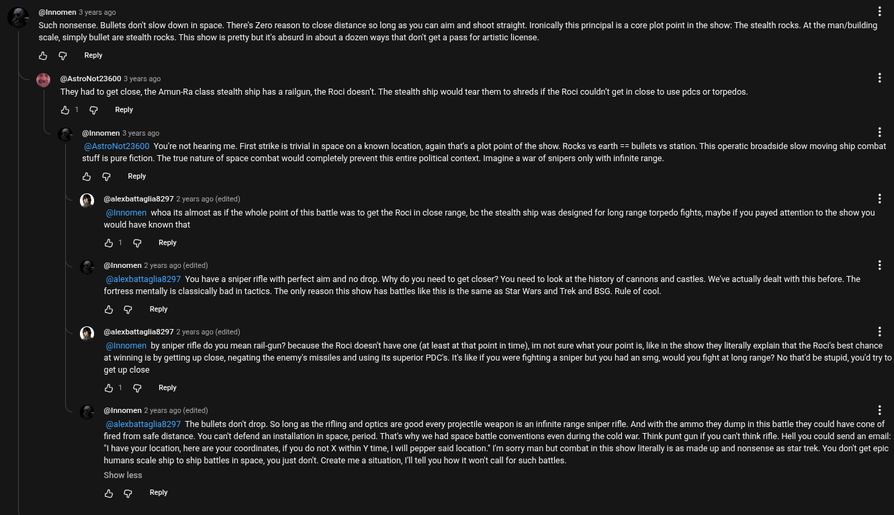

# Public Take transcript

## Machine transcription

@Innomen 3 years ago

Such nonsense. Bullets don' slow down in space. There's Zero reason to close distance 5o long as you can aim and shoot straight.Ironically this principal is a core plot point in the show: The stealth rocks. At the man/building
scale, simply bullet are stealth rocks. This show is pretty but its absurd in about a dozen ways that dorit get a pass for aristic icense.

&H @ Rey
@AstroNot23600 3 years ago
They had to get close, the Amun-Ra class stealth ship has a railgun, the Roci doesn't The stealth ship would tear them to shreds if the Roci couldn't get in close to use pdcs or torpedos.
b1 G Ry

@innomen 3 years ago

(@AStoNot23600 Youe not hearing me. First strike is trivial In space on a known location, again that's a plot point of the show. Rocks vs earth == bullets vs station. This operatic broadside slow moving ship combat
stuff is pure fiction. The true nature of space combat would completely prevent this entire political context. Imagine a war of snipers only with infinite range.

& @ Reny

() @slexbattaglias257 2 years ago (edited)

@nnomen whoa its almost as if the whole point of this battle was to get the Roci n close range, be the stealth ship was designed for long range torpedo fights, maybe if you payed attention to the show you
would have known that

H1 @ Repy

@Innomen 2 years ago (edited)

(@alexbattagliaB297 You have a sniper ifle with perfect aim and no drop. Why do you need to get closer? You need to look at the history of cannons and castles. We've actually dealt with this before. The
fortress mentally is classically bad in tactics. The only reason this show has battles lie this is the same as Star Wars and Trek and BSG. Rule of cool.

& @ Rey

() @slexbattaglian257 2 years ago (edited) H

(@nnomen by sniper ifle do you mean rail-gun? because the Roci doesnit have one (at least at that point in time), im not sure what your poirtis, ke in the show they literally explain that the Roc's best chance

atwinning is by getting up close, negating the enemy's missiles and using its superior PDCs. Its like if you were ighting a sniper but you had an smg, would you fight at long range? No thatd be stupid, you'd try to

getup close
&1 @ Rey
“_ @innomen 2 years ago (edited) g

(@alexbattagliaB297 The bullets donit drop. So long as the rifling and optics are good every projectile weapon is an infinite range sniper rifle. And with the ammo they dump in this battle they could have cone of
fired from safe distance. You canit defend an installation in space, period. That's why we had space battle conventions even during the cold war. Think punt gun if you can't think rfle. Hell you could send an email
" have your location, here are your coordinates, if you do not X within Y time, | will pepper said location. I'm sorry man but combat in this show liteally is as made up and nonsense as star trek. You dorit get epic
humans scale ship to ship battles in space, you just dorit. Create me a situation, 1l ell you how it worit call for such battles.

sShow less

5 @ Rey
