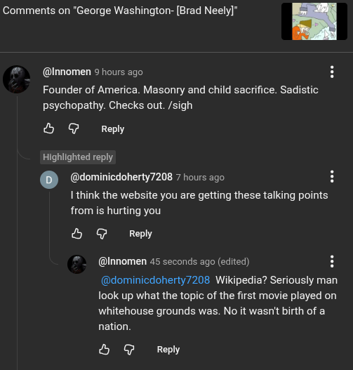

# Public Take transcript

## Machine transcription

Comments on "George Washington- [Brad Neely]" .

@Innomen 9 hours ago

Founder of America. Masonry and child sacrifice. Sadistic
psychopathy. Checks out. /sigh

& @ Reply

Highlighted reply
(@dominicdoherty7208 7 hours ago H
I think the website you are getting these talking points
from is hurting you

& @ Reply

@Innomen 45 seconds ago (edited) H

@dominicdoherty7208 Wikipedia? Seriously man
look up what the topic of the first movie played on
whitehouse grounds was. No it wasn't birth of a
nation.

& @ Reply
