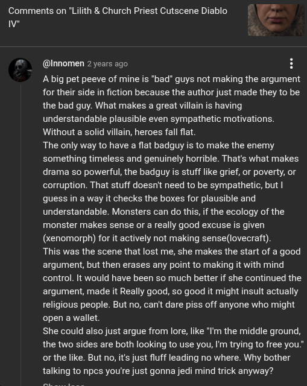

# Public Take transcript

## Machine transcription

Comments on "Lilith & Church Priest Cutscene Diablo e

v

-

@Innomen 2 years ago H
Abig pet peeve of mine is "bad" guys not making the argument
for their side i fiction because the author just made they to be
the bad guy. What makes a great villain is having
understandable plausible even sympathetic motivations.
Without a solid villain, heroes fall flat.

The only way to have a flat badguy is to make the enemy
something timeless and genuinely horrible. That's what makes
drama so powerful, the badguy is stuff like grief, or poverty, or
corruption. That stuff doesn't need to be sympathetic, but |
guess in a way it checks the boxes for plausible and
understandable. Monsters can do this, if the ecology of the
monster makes sense or a really good excuse is given
(xenomorph) for it actively not making sense(lovecraft).

This was the scene that lost me, she makes the start of a good
argument, but then erases any point to making it with mind
control. It would have been so much better if she continued the
argument, made it Really good, so good it might insult actually
religious people. But no, can't dare piss off anyone who might
open a wallet.

She could also just argue from lore, like *I'm the middle ground,
the two sides are both looking to use you, I'm trying to free you."
orthe like. But no, its just fluff leading no where. Why bother
talking to npcs you're just gonna jedi mind trick anyway?
