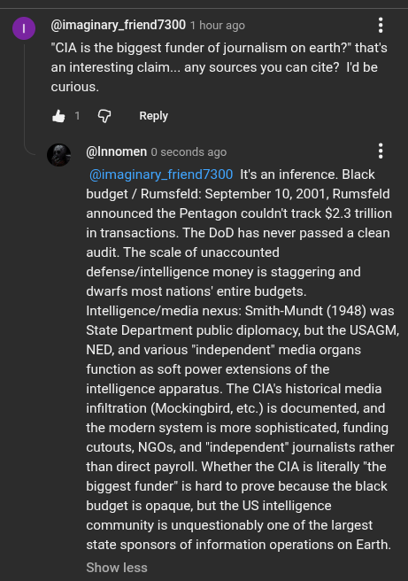

# Public Take transcript

## Machine transcription

@imaginary_friend7300 1 hour ago

*CIA is the biggest funder of journalism on earth?” that's
aninteresting claim... any sources you can cite? Id be
curious.

&

& Reply

@lnnomen 0 seconds ago H
@imaginary_friend7300 It's an inference. Black
budget / Rumsfeld: September 10, 2001, Rumsfeld
announced the Pentagon couldnit track $2.3 trllion
in transactions. The DoD has never passed a clean
audit. The scale of unaccounted
defense/intelligence money is staggering and
dwarfs most nations' entire budgets.
Intelligence/media nexus: Smith-Mundt (1948) was
State Department public diplomacy, but the USAGM,
NED, and various ‘independent’ media organs.
function as soft power extensions of the
intelligence apparatus. The CIA's historical media
infiltration (Mockingbird, etc.) is documented, and
the modern system is more sophisticated, funding
cutouts, NGOs, and 'independent” journalists rather
than direct payroll. Whether the CIA is literally ‘the
biggest funder” is hard to prove because the black
budget is opaque, but the US intelligence
community is unquestionably one of the largest
state sponsors of information operations on Earth.

Show less
