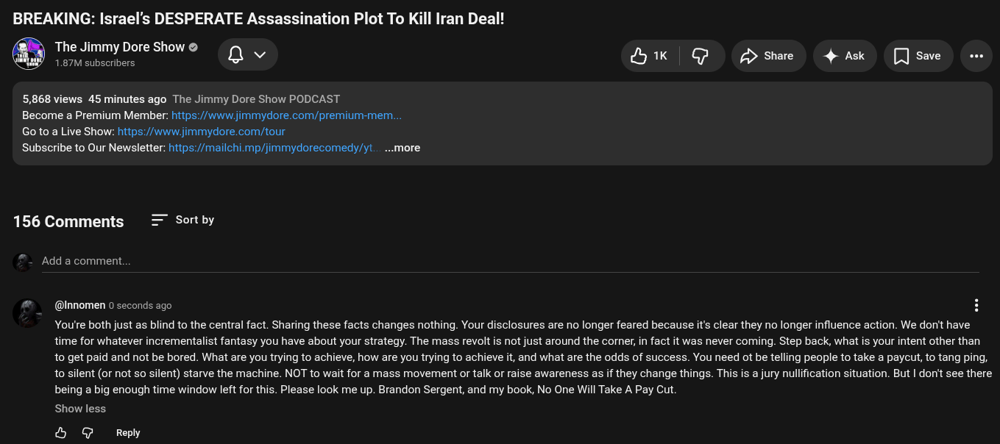

# Public Take transcript

## Machine transcription

BREAKING: Israel's DESPERATE Assassination Plot To
@ T:fd:[fmgf re Show e Qv Bk G Pshae 4 Ask  [Jsae e

5,868 views 45 minutes ago The Jimmy Dore Show PODCAST
Become a Premium Member: fittps:/www.jimmydore.com/premium-menn...

Go to a Live Show: https://www jimmydore.com/tour

Subscribe to Our Newsletter: ttps://mailchi.mp/jimmydorecomedy/yt. - ..more

Iran Deal!

156 Comments = Sortby

Add a comment

(@Innomen 0 seconds ago H
You're both just as blind to the central fact. Sharing these facts changes nothing. Your disclosures are no longer feared because it's clear they no longer influence action. We don't have
time for whatever incrementalist fantasy you have about your strategy. The mass revolt is not just around the corner, in fact it was never coming. Step back, what is your intent other than
1o get paid and not be bored. What are you trying to achieve, how are you trying to achieve it, and what are the odds of success. You need ot be telling people to take a paycut, to tang ping,
1o silent (or not so silent) starve the machine. NOT to wait for a mass movement or talk or raise awareness as if they change things. This is a jury nullfication situation. But | don't see there
being a big enough time window left for this. Please look me up. Brandon Sergent, and my book, No One Will Take A Pay Cut.

Show less

& @ Reply
