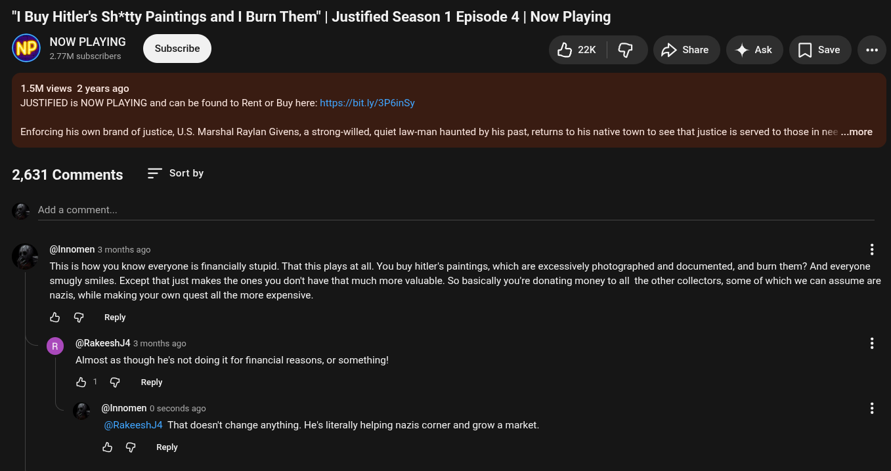

# Public Take transcript

## Machine transcription

"I Buy Hitler's Sh*tty Paintings and | Burn Them" | Justified Season 1 Episode 4 | Now Playing

NOW PLAYING
@ 2.77M subscribers dH2k G g share 4 Ak [] save

1.5M views 2 years ago
JUSTIFIED is NOW PLAYING and can be found to Rent or Buy here: https:/bit.ly/3P6inSy

Enforcing his own brand of justice, U.S. Marshal Raylan Givens, a strong-willed, quiet law-man haunted by his past, returs to his native town to see that justice is served to those in nec ...more

2,631 Comments Sort by

Add a comment

@lnnomen 3 monhs ago

This is how you know everyone s financially stupid. That this plays at all. You buy hitler's paintings, which are excessively photographed and documented, and bum them? And everyone

smugly smiles. Except that just makes the ones you don' have that much more valuable. So basically you're donating money to all the other collectors, some of which we can assume are
nazis, while making your own quest all the more expensive.

& @ Reply

@RakeeshJ4 3 months ago

Almost as though he's not doing it for financial reasons, or something!

&1 G Reply

@Innomen 0 seconds ago

(@RakeeshJ4 That doesn't change anything. He's literally helping nazis corner and grow a market.

& @ Reply
