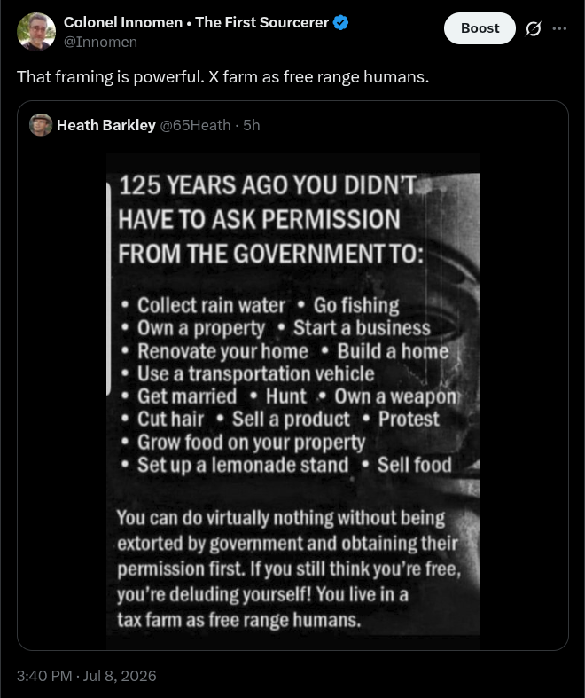

# Public Take transcript

## Machine transcription

. Colonel Innomen « The First Sourcerer & o
@Innomen

That framing is powerful. X farm as free range humans.

@ Heath Barkley @65Heath - 5h

125 YEARS AGO YOU DIDN'T:
HAVETO ASK PERMISSION
FROM THE GOVERNMENT TO:

* Collect rain water * Go fishing &

* Own a property * Starta business _

* Renovate yourhome * Build a hom

* Use a transportation vehicle ).

* Getmarried * Hunt * Own aweapon) |

* Cut hair * Sell a product * Protest

* Grow food on your property

* Setup a lemonade stand * Sell food «
=

You can do virtually nothing without being
extorted by government and obtaining theil
permission first. If you still think you're free,
you're deluding yourself! You live in a

tax farm as free range humans.

3:40 PM - Jul 8, 2026
