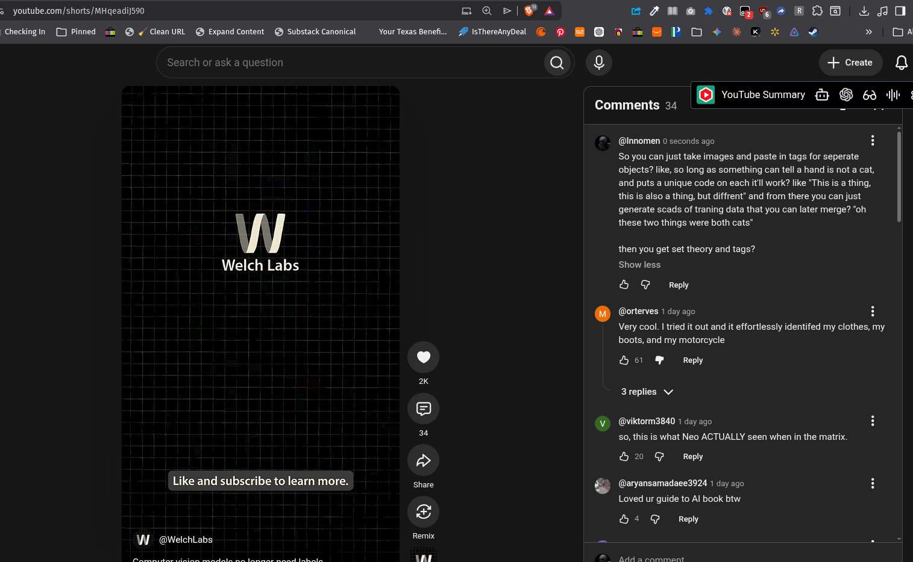

# Public Take transcript

## Machine transcription

s youtube.com/shorts/MHgeadij590 o @ > |9 A ZZ2Me » @ s ROE L L0
CheckingIn  [J Pinned «m @ o Clean URL @ Expand Content @ Substack Canonical Your Texas Benefi.. 7 IsThereAnyDeal @ © @ @ @ = & P O + ¥ « %t A @ » [

arch or as

k a question Q 9 + creaste
. YouTube Summary €3 @& 63 it

Comments 34

@Innomen 0 seconds ago

So you can just take images and paste in tags for seperate
objects? like, so long as something can tell a hand is not a cat,
and puts a unique code on each itll work? like *This is a thing,
this is also a thing, but diffrent’ and from there you can just
generate scads of traning data that you can later merge? "oh
these two things were both cats”

then you get set theory and tags?

Welch Labs Show less
O G Repy
. (@orterves 1 day ago H

Very cool. | tried it out and it effortlessly identifed my clothes, my
boots, and my motorcycle

L J &6l & Reply
x
3replies v

V' @viktorm3840 1 day ago

34 50, this is what Neo ACTUALLY seen when in the matrix.
P &H20 @ Reply
Like and subscribe to learn more. Share & (@aryansamadaee3924 1 day ago H
Loved ur guide to Al book btw.
&=
& &H 4 @ Reply
W @WelchLabs R - n -

YY) R Y I* D ——
