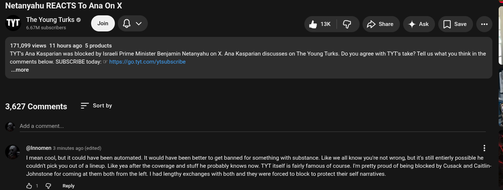

# Public Take transcript

## Machine transcription

Netanyahu REACTS To Ana On X
wr :SfM‘gfflfihl'k“ o Qv 13K G PDshae 4 ask  [Jsae e

171,099 views 11 hours ago 5 products

TYTs Ana Kasparian was blocked by Israeli Prime Minister Benjamin Netanyahu on X. Ana Kasparian discusses on The Young Turks. Do you agree with TYT's take? Tell us what you think in the
comments below. SUBSCRIBE today: & hitps://o.tyt.com/ytsubscribe
~.more

3,627 Comments Sort by

Add a comment

@lnnomen 3 minutes ago (edited) H
I mean cool, but it could have been automated. It would have been better to get banned for something with substance. Like we all know you're not wrong, but it's still entierly possible he
couldn' pick you out of a lineup. Like yea after the coverage and stuff he probably knows now. TYT itself is fairly famous of course. Im pretty proud of being blocked by Cusack and Caitlin-

Johnstone for coming at them both from the left. | had lengthy exchanges with both and they were forced to block to protect their self narratives.

&1 G Reply

I pe——— ... -
