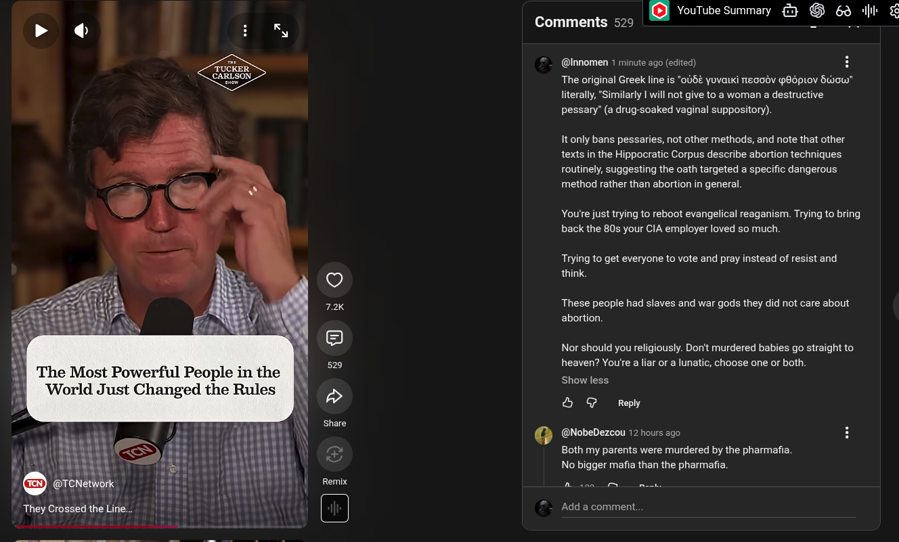

# Public Take transcript

## Machine transcription

The Most Powerful People in the
‘World Just Changed the Rules

0 (@NobeDezcou 12 hours ago

@ vouube summary €3 @ 63 il

Comments 529

(@Innomen 1 minute ago (edited) H
The original Greek line is *0UBE yuvatki neodv pBOpLOV Stow"
literally, Similarly | will not give to a woman a destructive
pessary’ (a drug-soaked vaginal suppository).

It only bans pessaries, not other methods, and note that other
texts in the Hippocratic Corpus describe abortion techniques
routinely, suggesting the oath targeted a specific dangerous
method rather than abortion in general

You're just trying to reboot evangelical reaganism. Trying to bring
back the 80s your CIA employer loved so much.

Trying to get everyone to vote and pray instead of resist and
think.

These people had slaves and war gods they did not care about
abortion

Nor should you religiously. Don't murdered babies go straight to
heaven? You're a liar or a lunatic, choose one or both.

Show less

& @ Reply

Both my parents were murdered by the pharmafia.
No bigger mafia than the pharmafia.

Add a comment.
