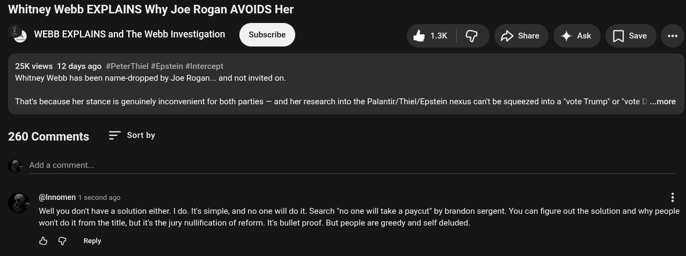

# Public Take transcript

## Machine transcription

Whitney Webb EXPLAINS Why Joe Rogan AVOIDS Her
@ WEBB EXPLAINS and The Webb Investigation & x G £> Share 4 Ask [save o

25K views 12 days ago #PeterThiel #Epstein #Intercept
Whitney Webb has been name-dropped by Joe Rogan... and not invited on.

That's because her stance is genuinely inconvenient for both parties — and her research into the Palantir/Thiel/Epstein nexus can't be squeezed into a "vote Trump" or 'vote [ ...more

260 Comments Sort by

Add a comment.

@lnnomen 1 second

g0 E

Well you donit have a solution either. | do. It's simple, and no one will do it. Search "o one will take a paycut” by brandon sergent. You can figure out the solution and why people
won't do it from the title, but it's the jury nullification of reform. It's bullet proof. But people are greedy and self deluded.

& @ Reply
