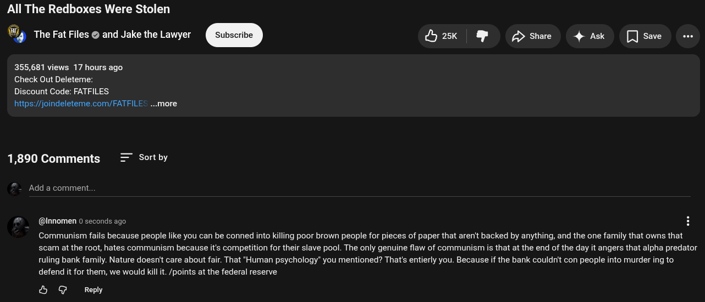

# Public Take transcript

## Machine transcription

All The Redboxes Were Stolen

@‘ The Fat Files @ and Jake the Lawyer Sul

yask & shae 4 Ak []save e

355,681 views 17 hours ago
Check Out Deleteme:

Discount Code: FATFILES
https:/joindeleteme.com/FATFILES

1,890 Comments = Sortby

Add a comment.

(@Innomen 0 seconds ago H
Communism fails because people like you can be conned into killing poor brown people for pieces of paper that aren't backed by anything, and the one family that owns that
scam at the root, hates communism because it's competition for their slave pool. The only genuine flaw of communism is that at the end of the day it angers that alpha predator
ruling bank family. Nature doesn't care about fair. That "Human psychology” you mentioned? That's entierly you. Because if the bank couldn't con people into murder ing to
defend it for them, we would kill it. /points at the federal reserve

& @ Reply
