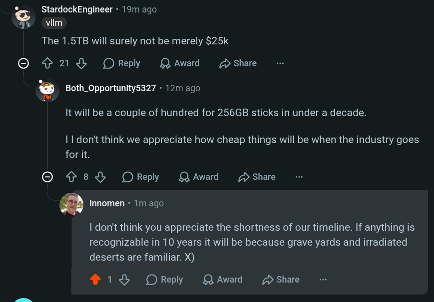

# Public Take transcript

## Machine transcription

o StardockEngineer - 19m ago
g viim

The 1.5TB will surely not be merely $25k
O ¢ 21 % OReply LQAward D Share
? Both_Opportunity5327 « 12m ago

It will be a couple of hundred for 256GB sticks in under a decade.

I 1 don't think we appreciate how cheap things will be when the industry goes
for it.

O ¢ 8% OReply LQAward D Share

Q Innomen - 1m ago

| don't think you appreciate the shortness of our timeline. If anything is
recognizable in 10 years it will be because grave yards and irradiated
deserts are familiar. X)

® 18 OReply LQAward D Share
