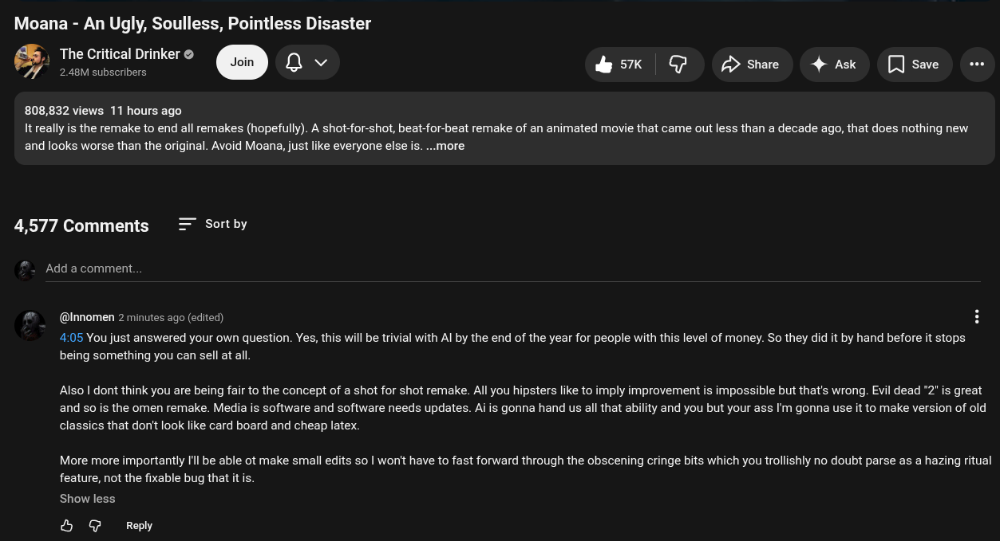

# Public Take transcript

## Machine transcription

Moana - An Ugly, Soulless, Pointless Disaster
., The Critical Drinker ©
& Teoncaomicre @Y @ &K @ Dowe 4w Qo

808,832 views 11 hours ago

It really is the remake to end all remakes (hopefully). A shot-for-shot, beat-for-beat remake of an animated movie that came out less than a decade ago, that does nothing new
and looks worse than the original. Avoid Moana, just like everyone else is. ...more

4,577 Comments Sort by
Add a comment.
@ @Innomen 2 minutes ago (edited) 5

405 You just answered your own question. Yes, this will be trivial with Al by the end of the year for people with this level of money. So they did it by hand before it stops
being something you can sell at all.

Also | dont think you are being fair to the concept of a shot for shot remake. All you hipsters like to imply improvement is impossible but that's wrong. Evil dead 2" s great
and so is the omen remake. Media is software and software needs updates. Ai is gonna hand us all that ability and you but your ass I'm gonna use it to make version of old
classics that don't look like card board and cheap latex.

More more importantly Il be able ot make small edits so | won't have to fast forward through the obscening cringe bits which you trollishly no doubt parse as a hazing ritual
feature, not the fixable bug that itis.

Show less

& @ Reply
