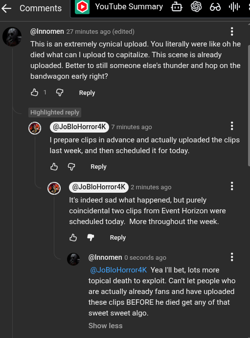

# Public Take transcript

## Machine transcription

& Comments | [) YouTube Summary 3 & 69 il

@Innomen 27 minutes ago (edited) H

This is an extremely cynical upload. You literally were like oh he
died what can | upload to capitalize. This scene is already
uploaded. Better to still someone else’s thunder and hop on the
bandwagon early right?

&1 G Reply

Highlighted reply

@ (@JoBloHorror4K RANMTEEEre) H

I prepare clips in advance and actually uploaded the clips.
last week, and then scheduled it for today.

& @ Reply
@ @JoBloHorror4K FRUeeprey

Its indeed sad what happened, but purely
coincidental two clips from Event Horizon were
scheduled today. More throughout the week.

S ¥ Reply

@Innomen 0 seconds ago

@JoBloHorror4K Yea Il bet, lots more
topical death to exploit. Can' let people who
are actually already fans and have uploaded
these clips BEFORE he died get any of that
sweet sweet algo.

Show less
