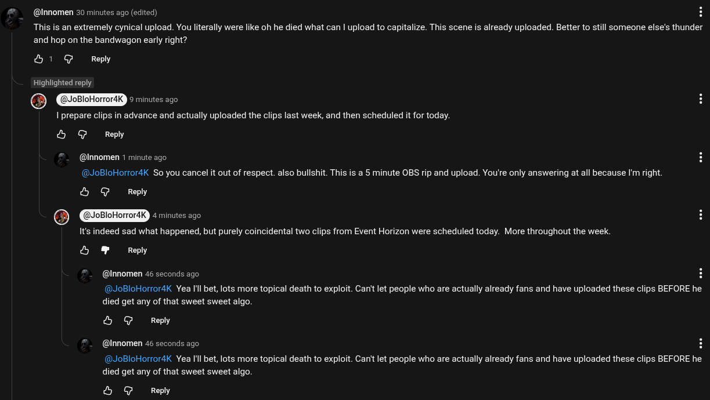

# Public Take transcript

## Machine transcription

@Innomen 30 minutes ago (edited)

This i an extremely cynical upload. You literally were like oh he died what can | upload to capitalize. This scene is already uploaded. Better to still someone else's thunder
and hop on the bandwagon early right?

&1 G Reply

Highlighted reply

@ WPETTTaELd © minutes ago

I prepare clips in advance and actually uploaded the clips last week, and then scheduled it for today.
& @ Reply

@Innomen 1 minute ago
@JoBloHoror4K So you cancel it out of respect. also bullshit. This is a 5 minute OBS rip and upload. You're only answering at all because I'm right.

& @ Reply
@ JoBloHorrordK JRGIEeery

It's indeed sad what happened, but purely coincidental two clips from Event Horizon were scheduled today. More throughout the week.

S & Reply

@Innomen 46 seconds ago

@JoBloHorrordK Yea Il bet, lots more topical death to exploit. Can't et people who are actually already fans and have uploaded these clips BEFORE he
died get any of that sweet sweet algo.

& @ Repy

@Innomen 46 seconds ago

@JoBloHorrordK Yea Il bet, lots more topical death to exploit. Can't et people who are actually already fans and have uploaded these clips BEFORE he
died get any of that sweet sweet algo.

& @ Reply
