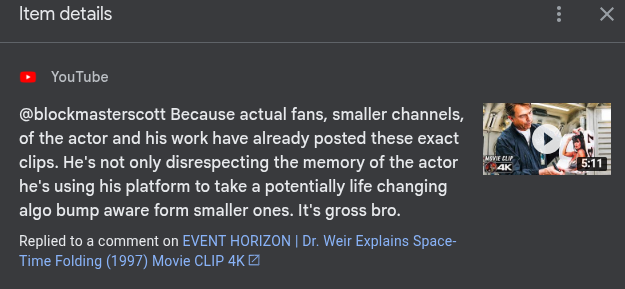

# Public Take transcript

## Machine transcription

Item details

i X

> YouTube

@blockmasterscott Because actual fans, smaller channels,
of the actor and his work have already posted these exact
clips. He's not only disrespecting the memory of the actor
he's using his platform to take a potentially life changing
algo bump aware form smaller ones. It's gross bro.

Replied to a comment on EVENT HORIZON | Dr. Weir Explains Space-
Time Folding (1997) Movie CLIP 4K &
