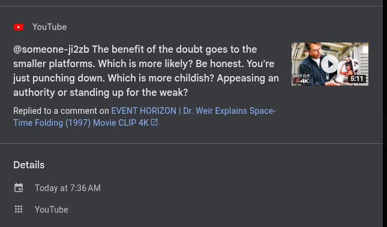

# Public Take transcript

## Machine transcription

> YouTube

@someone-ji2zb The benefit of the doubt goes to the
smaller platforms. Which is more likely? Be honest. You're
just punching down. Which is more childish? Appeasing an
authority or standing up for the weak?

Replied to a comment on EVENT HORIZON | Dr. Weir Explains Space-
Time Folding (1997) Movie CLIP 4K &

Details

B Today at 7:36 AM

YouTube
