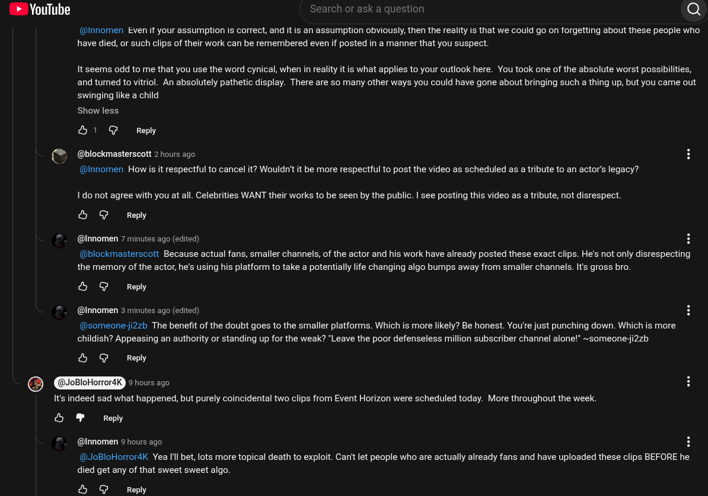

# Public Take transcript

## Machine transcription

(% YouTube earch or ask a question (e}

(@innomen Even if your assumption is correct, and it is an assumption obviously, then the reality is that we could go on forgetting about these people who
have died, or such clips of their work can be remembered even if posted in a manner that you suspect

It seems odd to me that you use the word cynical, when in reality it is what applies to your outlook here. You took one of the absolute worst possibilities,
and tumed to vitriol. An absolutely pathetic display. There are so many other ways you could have gone about bringing such a thing up, but you came out
swinging like a child

Show less

&1 G Reply

(“ (@blockmasterscott 2 hours ago
" @Innomen How is it respectful to cancel it? Wouldn't it be more respectful to post the video as scheduled as a tribute to an actor's legacy?

1 do not agree with you at all. Celebrities WANT their works to be seen by the public. | see posting this video as a tribute, not disrespect.

& @ Reply

(@Innomen 7 minutes ago (edited) H

@blockmasterscott Because actual fans, smaller channels, of the actor and his work have already posted these exact clips. He's not only disrespecting
the memory of the actor, he's using his platform to take a potentially life changing algo bumps away from smaller channels. It's gross bro.

& @ Reply

@Innomen 3 minutes ago (edited)

(@someone-ji2zb The benefit of the doubt goes to the smaller platforms. Which is more likely? Be honest. You're just punching down. Which is more
childish? Appeasing an authority or standing up for the weak? "Leave the poor defenseless million subscriber channel alone!” ~someone-i2zb

L G Reply
@ RLTTRELd © hours ago

It's indeed sad what happened, but purely coincidental two clips from Event Horizon were scheduled today. More throughout the week.

S & Reply

(@Innomen 9 hours ago. H
(@JoBloHorror4K Yea Il bet, lots more topical death to exploit. Can't let people who are actually already fans and have uploaded these clips BEFORE he
died get any of that sweet sweet algo.

& @ Reply
