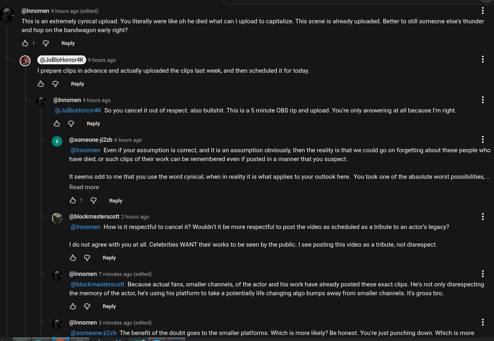

# Public Take transcript

## Machine transcription

@Innomen 9 hours ago (edited) H

This i an extremely cynical upload. You literally were like oh he died what can | upload to capitalize. This scene is already uploaded. Better to still someone else's thunder
and hop on the bandwagon early right?

&1 G Reply
@ (@JoBloHorrordK IR

| prepare clips in advance and actually uploaded the clips last week, and then scheduled it for today.

& @ Reply

@Innomen 9 hours ago

@JoBloHoror4K So you cancel it out of respect. also bullshit. This is a 5 minute OBS rip and upload. You're only answering at all because I'm right.

& @ Reply

@ @someonesizzh & hours ag0 H

@Innomen Even if your assumption is correct, and it is an assumption obviously, then the reality is that we could go on forgetting about these people who
have died, or such clips of their work can be remembered even if posted in a manner that you suspect.

It seems odd to me that you use the word cynical, when in reality it is what applies to your outlook here. You took one of the absolute worst possibilities,
Read more

&1 G Reply

(“ (@blockmasterscott 2 hours ago

@Innomen How i it respectful to cancel it? Wouldn't it be more respectful to post the video as scheduled as a tribute to an actor's legacy?

1 do not agree with you at all. Celebrities WANT their works to be seen by the public. | see posting this video as a tribute, not disrespect.

& @ Reply

@Innomen 7 minutes ago (edited) H

@blockmasterscott Because actual fans, smaller channels, of the actor and his work have already posted these exact clips. He's not only disrespecting
the memory of the actor, he's using his platform to take a potentially life changing algo bumps away from smaller channels. It's gross bro.

& @ Reply

@Innomen 3 minutes ago (edited)

(@someone-ji2zb The benefit of the doubt goes to the smaller platforms. Which is more likely? Be honest. You're just punching down. Which is more
