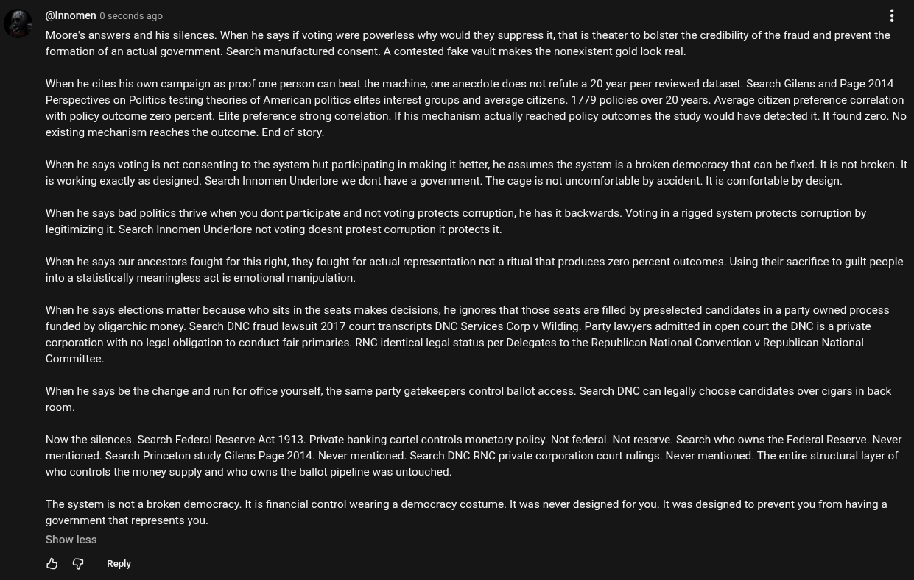

# Public Take transcript

## Machine transcription

@Innomen 0 seconds ago H

Moore's answers and his silences. When he says if voting were powerless why would they suppress it, that is theater to bolster the credibility of the fraud and prevent the
formation of an actual government. Search manufactured consent. A contested fake vault makes the nonexistent gold look real.

When he cites his own campaign as proof one person can beat the machine, one anecdote does not refute a 20 year peer reviewed dataset. Search Gilens and Page 2014
Perspectives on Politics testing theories of American politics elites interest groups and average citizens. 1779 policies over 20 years. Average citizen preference correlation
with policy outcome zero percent. Elite preference strong correlation. If his mechanism actually reached policy outcomes the study would have detected it. It found zero. No
existing mechanism reaches the outcome. End of story.

When he says voting s not consenting to the system but participating in making it better, he assumes the system is a broken democracy that can be fixed. Itis not broken. It
is working exactly as designed. Search Innomen Underlore we dont have a government. The cage is not uncomfortable by accident. It is comfortable by design

When he says bad politics thrive when you dont participate and not voting protects corruption, he has it backwards. Voting in a rigged system protects corruption by
legitimizing it. Search Innomen Underlore not voting doesnt protest corruption it protects it.

When he says our ancestors fought for this right, they fought for actual representation not a ritual that produces zero percent outcomes. Using their sacrifice to guilt people
into a statistically meaningless act is emotional manipulation.

When he says elections matter because who sits in the seats makes decisions, he ignores that those seats are filled by preselected candidates in a party owned process
funded by oligarchic money. Search DNC fraud lawsuit 2017 court transcripts DNC Services Corp v Wilding. Party lawyers admitted in open court the DNC is a private
corporation with no legal obligation to conduct fair primaries. RNC identical legal status per Delegates to the Republican National Convention v Republican National
Committee.

When he says be the change and run for office yourself, the same party gatekeepers control ballot access. Search DNC can legally choose candidates over cigars in back
room.

Now the silences. Search Federal Reserve Act 1913. Private banking cartel controls monetary policy. Not federal. Not reserve. Search who owns the Federal Reserve. Never
mentioned. Search Princeton study Gilens Page 2014. Never mentioned. Search DNC RNC private corporation court rulings. Never mentioned. The entire structural layer of
who controls the money supply and who owns the ballot pipeline was untouched.

The system is not a broken democracy. It is financial control wearing a democracy costume. It was never designed for you. It was designed to prevent you from having a
government that represents you.

Show less

& @ Reply
