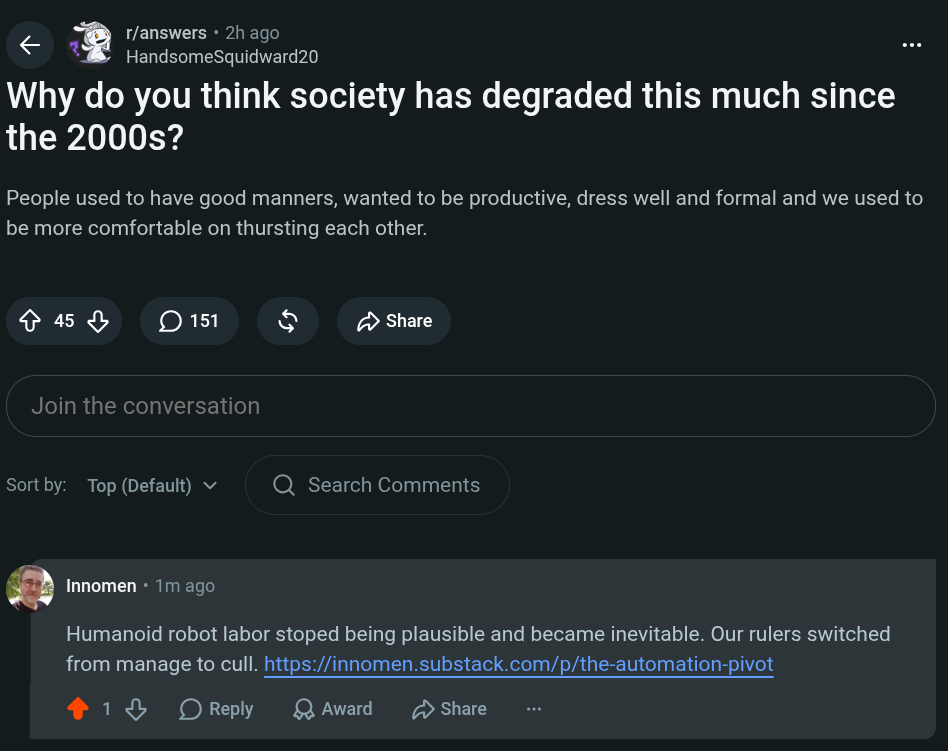

# Public Take transcript

## Machine transcription

< @ r/answers * 2h ago

HandsomeSquidward20

Why do you think society has degraded this much since
the 2000s?

People used to have good manners, wanted to be productive, dress well and formal and we used to
be more comfortable on thursting each other.

Sy D5 & 2> share

Join the conversation

Sortby: Top (Default) v Q Search Comments

@ Innomen - 1m ago

Humanoid robot labor stoped being plausible and became inevitable. Our rulers switched
from manage to cull. https://innomen.substack.com/p/the-automation-pivot

® 18 OReply LQAward D Share
