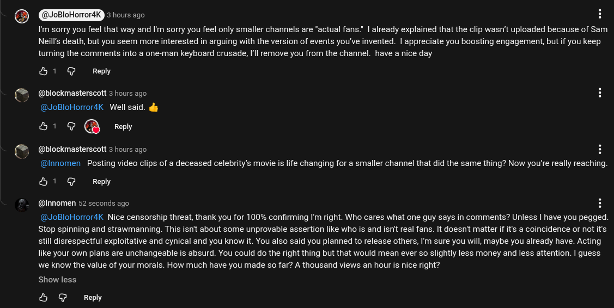

# Public Take transcript

## Machine transcription

€]

JoBloHorror4K ESTERtS

I'm sorry you feel that way and 'm sorry you feel only smaller channels are “actual fans." | already explained that the clip wasn't uploaded because of Sam
Neill's death, but you seem more interested in arguing with the version of events you've invented. | appreciate you boosting engagement, but if you keep
tumning the comments into a one-man keyboard crusade, Il remove you from the channel. have a nice day

&1 G Reply

@blockmasterscott 3 hours ago
@JoBloHorrordK  Well said. dy

H1 @ @ Reply

@blockmasterscott 3 hours ago H

@Innomen  Posting video clips of a deceased celebrity’s movie s life changing for a smaller channel that did the same thing? Now you're really reaching.
&H 1 G Reply

(@Innomen 52 seconds ago H
(@JoBloHorrordK Nice censorship threat, thank you for 100% confirming I'm right. Who cares what one guy says in comments? Unless | have you pegged
Stop spinning and strawmanning. This isn't about some unprovable assertion like who is and isnt real fans. It doesn't matter if it's a coincidence or not it's
still disrespectful exploitative and cynical and you know it. You also said you planned to release others, I'm sure you will, maybe you already have. Acting
like your own plans are unchangeable is absurd. You could do the right thing but that would mean ever so slightly less money and less attention. | guess
we know the value of your morals. How much have you made so far? A thousand views an hour is nice right?

Show less

& @ Reply
