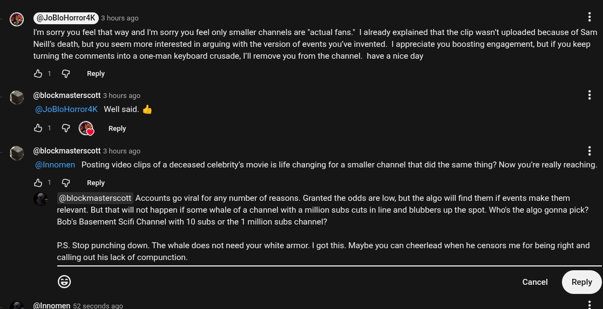

# Public Take transcript

## Machine transcription

€]

S

)JoBloHorror4K ERETCRT] H

I'm sorry you feel that way and 'm sorry you feel only smaller channels are “actual fans." | already explained that the clip wasn't uploaded because of Sam
Neill's death, but you seem more interested in arguing with the version of events you've invented. | appreciate you boosting engagement, but if you keep
tumning the comments into a one-man keyboard crusade, Il remove you from the channel. have a nice day

&1 G Reply

@blockmasterscott 3 hours ago
@JoBloHorrordK  Well said. dy

H1 @ @ Reply

@blockmasterscott 3 hours ago

@Innomen  Posting video clips of a deceased celebrity’s movie is life changing for a smaller channel that did the same thing? Now you're really reaching.

&H 1 G Reply

@blockmasterscott Accounts go viral for any number of reasons. Granted the odds are low, but the algo will find them if events make them
relevant. But that will not happen if some whale of a channel with a million subs cuts in line and blubbers up the spot. Who's the algo gonna pick?
Bob's Basement Scifi Channel with 10 subs or the 1 million subs channel?

PS. Stop punching down. The whale does not need your white armor. | got this. Maybe you can cheerlead when he censors me for being right and

calling out his lack of compunction

@Innomen 52 seconds ago H
