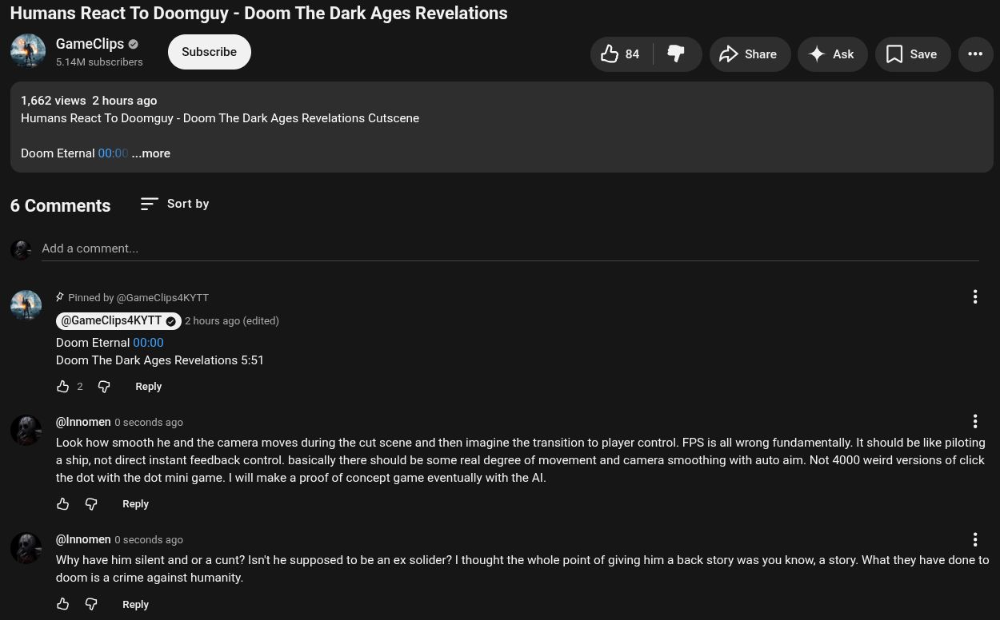

# Public Take transcript

## Machine transcription

Humans React To Doomguy - Doom The Dark Ages Revelations

GameClips © Subs

5 Ou & Do 4w Qo

1,662 views 2 hours ago
Humans React To Doomguy - Doom The Dark Ages Revelations Cutscene

Doom Eternal 00:0' ..more

6 Comments Sort by

Add a comment.

” # Pinned by @GameClips4KYTT

TSRO 2 hours ago (edited)
Doom Eternal 00:00
Doom The Dark Ages Revelations 5:51

&2 G Reply

@Innomen 0 seconds ago H

Look how smooth he and the camera moves during the cut scene and then imagine the transition to player control. FPS is all wrong fundamentally. It should be like piloting
a ship, not direct instant feedback control. basically there should be some real degree of movement and camera smoothing with auto aim. Not 4000 weird versions of click
the dot with the dot mini game. | will make a proof of concept game eventually with the Al

& @ Reply

(@Innomen 0 seconds ago H

Why have him silent and or a cunt? Isn't he supposed to be an ex solider? | thought the whole point of giving him a back story was you know, a story. What they have done to
doom s a crime against humanity.

& @ Reply
