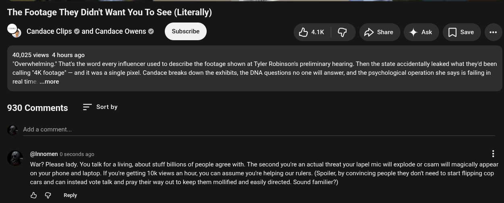

# Public Take transcript

## Machine transcription

The Footage They Didn't Want You To See (Literally)
cribe Hak G p> Share 4 Ask [ Save e

Candace Clips @ and Candace Owens @ Sul

40,025 views 4 hours ago
"Overwhelming." That's the word every influencer used to describe the footage shown at Tyler Robinson's preliminary hearing. Then the state accidentally leaked what they'd been
calling *4K footage’ — and it was a single pixel. Candace breaks down the exhibits, the DNA questions no one will answer, and the psychological operation she says is failing in
real time ..more

930 Comments Sort by

Add a comment.

@ @Innomen 0 seconds ago H

War? Please lady. You talk for a living, about stuff billions of people agree with. The second you're an actual threat your lapel mic will explode or csam will magically appear
on your phone and laptop. If you're getting 10k views an hour, you can assume you're helping our rulers. (Spoiler, by convincing people they dont need to start flipping cop
cars and can instead vote talk and pray their way out to keep them mollified and easily directed. Sound familier?)

& @ Reply
