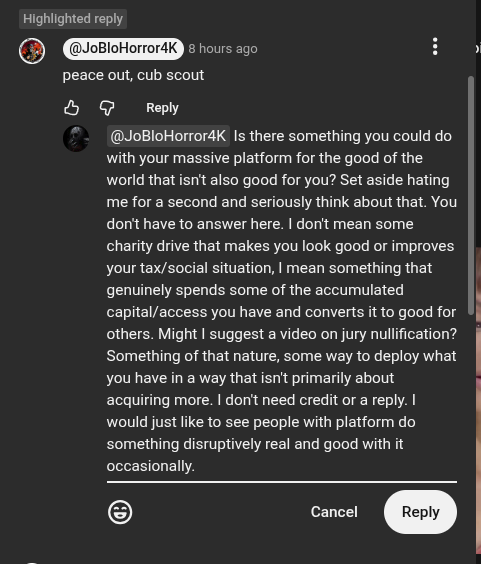

# Public Take transcript

## Machine transcription

Highlighted reply

@ oBloHorror4K TReTeR ] H s

peace out, cub scout

& @ Reply

@JoBloHorrordK s there something you could do
with your massive platform for the good of the
world that isn't also good for you? Set aside hating
me for a second and seriously think about that. You
don't have to answer here. | dorit mean some
charity drive that makes you look good or improves
your tax/social situation, | mean something that
genuinely spends some of the accumulated \
capital/access you have and converts it to good for ||
others. Might | suggest a video on jury nullfication?
Something of that nature, some way to deploy what |
you have in a way that isnit primarily about
acquiring more. | don't need credit or a reply. |
would just like to see people with platform do
something disruptively real and good with it
occasionally.
