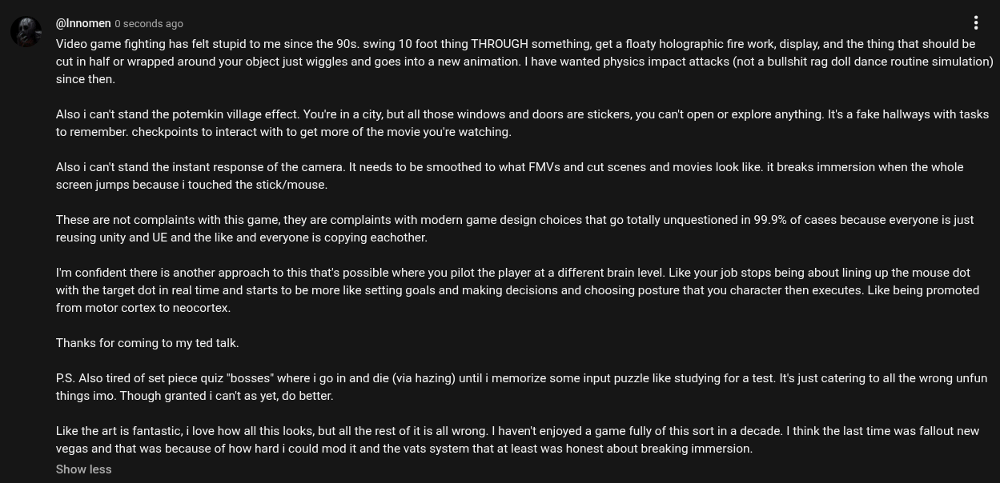

# Public Take transcript

## Machine transcription

@Innomen 0 seconds ago H

Video game fighting has felt stupid to me since the 90s. swing 10 foot thing THROUGH something, get a floaty holographic fire work, display, and the thing that should be
cut in half or wrapped around your object just wiggles and goes into a new animation. | have wanted physics impact attacks (not a bullshit rag doll dance routine simulation)
since then.

Also i can't stand the potemkin village effect. You're in a city, but all those windows and doors are stickers, you can't open or explore anything. Its a fake hallways with tasks
to remember. checkpoints to interact with to get more of the movie you're watching.

Also i can't stand the instant response of the camera. It needs to be smoothed to what FMVs and cut scenes and movies look like. it breaks immersion when the whole
screen jumps because i touched the stick/mouse.

These are not complaints with this game, they are complaints with modern game design choices that go totally unquestioned in 99.9% of cases because everyone s just
reusing unity and UE and the like and everyone is copying eachother.

I'm confident there is another approach to this that's possible where you pilot the player at a different brain level. Like your job stops being about lining up the mouse dot
with the target dot in real time and starts to be more like setting goals and making decisions and choosing posture that you character then executes. Like being promoted
from motor cortex to neocortex.

Thanks for coming to my ted talk.

PS. Also tired of set piece quiz "bosses” where i go in and die (via hazing) until i memorize some input puzzle like studying for a test. It's just catering to all the wrong unfun
things imo. Though granted i can't as yet, do better.

Like the art is fantastic, i love how all this looks, but all the rest of it is all wrong. | haven't enjoyed a game fully of this sort in a decade. | think the last time was fallout new
vegas and that was because of how hard i could mod it and the vats system that at least was honest about breaking immersion.

Show less
