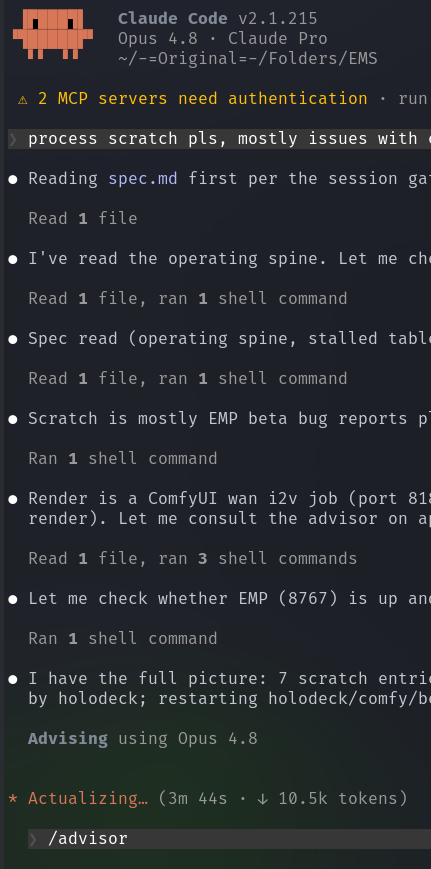

# Public Take transcript

## Machine transcription

Claude Code v2.1.215
Opus 4.8 - Claude Pro
~/-=0riginal=-/Folders/EMS

4 2 MCP servers need authentication - run
process scratch pls, mostly issues with

e Reading spec.md first per the session ga
Read 1 file

© I've read the operating spine. Let me ch
Read 1 file, ran 1 shell command

e Spec read (operating spine, stalled tabl
Read 1 file, ran 1 shell command

e Scratch is mostly EMP beta bug reports p
Ran 1 shell command

® Render is a ComfyUI wan i2v job (port 81
render). Let me consult the advisor on a

Read 1 file, ran 3 shell commands
e Let me check whether EMP (8767) is up an
Ran 1 shell command

© I have the full picture: 7 scratch entri
by holodeck; restarting holodeck/comfy/bi

Advising using Opus 4.8

* Actualizing.. (3m 44s - & 10.5k tokens)

/advisor
