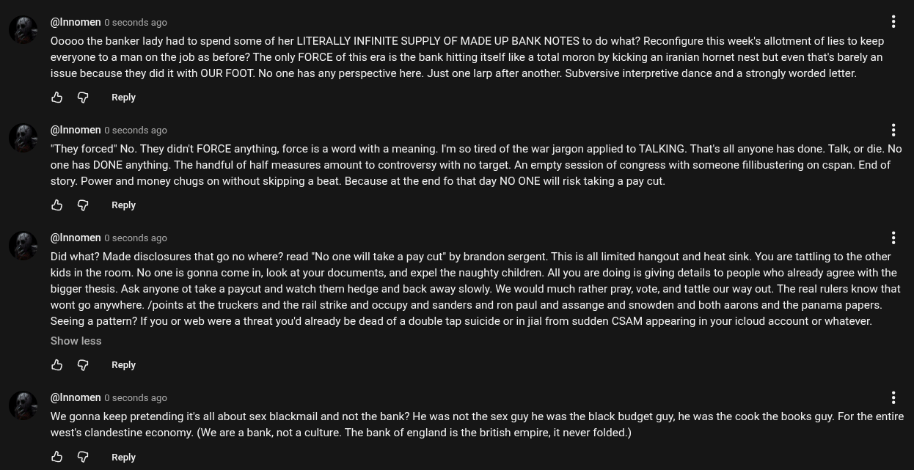

# Public Take transcript

## Machine transcription

@Innomen 0 seconds ago

00000 the banker lady had to spend some of her LITERALLY INFINITE SUPPLY OF MADE UP BANK NOTES to do what? Reconfigure this week's allotment of lies to keep.
everyone to a man on the job as before? The only FORCE of this era is the bank hitting itself like a total moron by kicking an iranian hornet nest but even that's barely an
issue because they did it with OUR FOOT. No one has any perspective here. Just one larp after another. Subversive interpretive dance and a strongly worded letter.

& @ Repy

@Innomen 0 seconds ago H

*They forced No. They didrit FORCE anything, force is a word with a meaning. I'm so tired of the war jargon applied to TALKING. That's all anyone has done. Talk, or die. No
one has DONE anything. The handful of half measures amount to controversy with no target. An empty session of congress with someone fillibustering on cspan. End of
story. Power and money chugs on without skipping a beat. Because at the end fo that day NO ONE wil risk taking a pay cut.

& @ Reply

@Innomen 0 seconds ago H

Did what? Made disclosures that go no where? read "No one will take a pay cut” by brandon sergent. This is all limited hangout and heat sink. You are tattling to the other
kids in the room. No one is gonna come i, look at your documents, and expel the naughty children. All you are doing s giving details to people who already agree with the
bigger thesis. Ask anyone ot take a paycut and watch them hedge and back away slowly. We would much rather pray, vote, and tattle our way out. The real rulers know that
wont go anywhere. /points at the truckers and the rail strike and occupy and sanders and ron paul and assange and snowden and both aarons and the panama papers.
Seeing a patter? If you or web were a threat you'd already be dead of a double tap suicide or in jial from sudden CSAM appearing in your icloud account or whatever.
Show less

& @ Reply

(@Innomen 0 seconds ago H

We gonna keep pretending it's all about sex blackmail and not the bank? He was not the sex guy he was the black budget guy, he was the cook the books guy. For the entire
west's clandestine economy. (We are a bank, not a culture. The bank of england is the british empire, it never folded.)

& @ Reply
