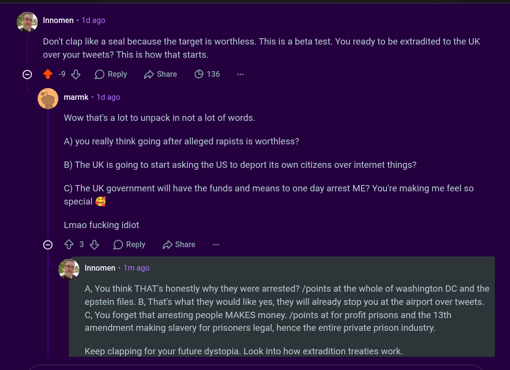

# Public Take transcript

## Machine transcription

Don't clap like a seal because the target is worthless. This is a beta test. You ready to be extradited to the UK
over your tweets? This is how that starts.

Q Innomen - 1d ago

O 9% OReply Dshae O 136
|

*. marmk - 1d ago

Wow that's a lot to unpack in not a lot of words.
A) you really think going after alleged rapists is worthless?
B) The UK is going to start asking the US to deport its own citizens over internet things?

C) The UK government will have the funds and means to one day arrest ME? You're making me feel so
special &

Lmao fucking idiot

© ¢3& ORely 2 share

*Q Innomen - 1m ago

A, You think THAT's honestly why they were arrested? /points at the whole of washington DC and the
epstein files. B, That's what they would like yes, they will already stop you at the airport over tweets.
C, You forget that arresting people MAKES money. /points at for profit prisons and the 13th
amendment making slavery for prisoners legal, hence the entire private prison industry.

Keep clapping for your future dystopia. Look into how extradition treaties work.
