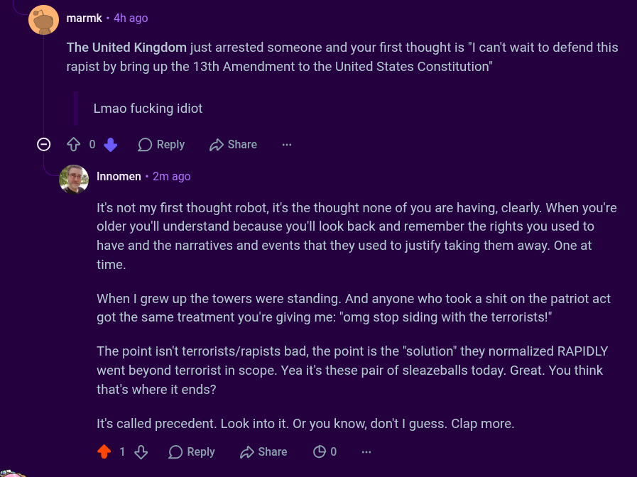

# Public Take transcript

## Machine transcription

marmk - 4h ago

The United Kingdom just arrested someone and your first thought is "I can't wait to defend this
rapist by bring up the 13th Amendment to the United States Constitution”

Lmao fucking idiot

© ¢ 0% OReply share
|

,. Innomen - 2m ago

It's not my first thought robot, it's the thought none of you are having, clearly. When you're
older you'll understand because you'll look back and remember the rights you used to
have and the narratives and events that they used to justify taking them away. One at
time.

When | grew up the towers were standing. And anyone who took a shit on the patriot act
got the same treatment you're giving me: "omg stop siding with the terrorists!"

The point isn't terrorists/rapists bad, the point is the "solution" they normalized RAPIDLY
went beyond terrorist in scope. Yea it's these pair of sleazeballs today. Great. You think
that's where it ends?

It's called precedent. Look into it. Or you know, don't | guess. Clap more.

218% OReply Hshae OO0
