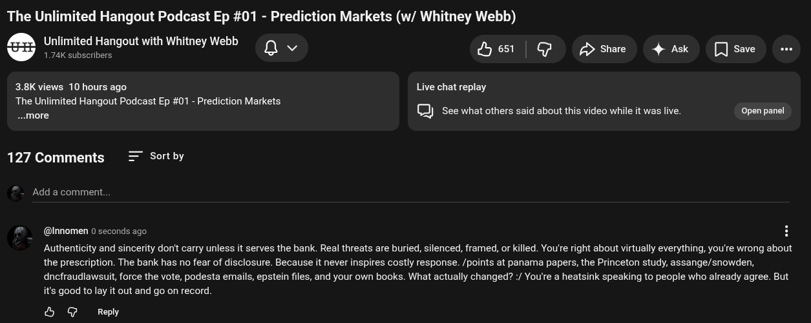

# Public Take transcript

## Machine transcription

The Unlimited Hangout Podcast Ep #01 - Prediction Markets (w/ Whitney Webb)

M, nlimited Hangout with Whitney Webb
N 172k subscrivers Qv Hest | P £> share 4 Ask [

3.8K views 10 hours ago Live chat replay
The Unlimited Hangout Podcast Ep #01 - Prediction Markets
more C3) See what others said about this video while it was live. Open panel

127 Comments Sort by

Add a comment.

(@Innomen 0 seconds ago H
Authenticity and sincerity don't carry unless it serves the bank. Real threats are buried, silenced, framed, or killed. You're right about virtually everything, you're wrong about
the prescription. The bank has no fear of disclosure. Because it never inspires costly response. /points at panama papers, the Princeton study, assange/snowden,
dncfraudiawsuit, force the vote, podesta emails, epstein files, and your own books. What actually changed? / You're a heatsink speaking to people who already agree. But
it's good to lay it out and go on record.

& @ Repy
