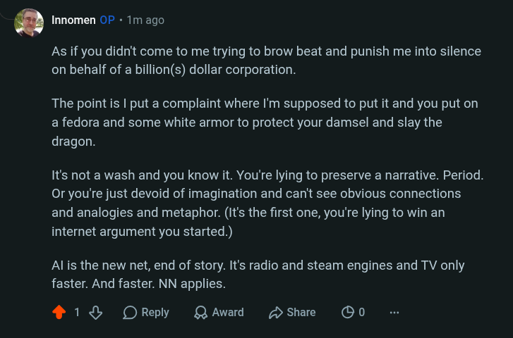

# Public Take transcript

## Machine transcription

‘ Innomen OF - 1m ago

As if you didn't come to me trying to brow beat and punish me into silence
on behalf of a billion(s) dollar corporation.

The point is | put a complaint where I'm supposed to put it and you put on
a fedora and some white armor to protect your damsel and slay the
dragon.

It's not a wash and you know it. You're lying to preserve a narrative. Period.
Or you're just devoid of imagination and can't see obvious connections
and analogies and metaphor. (It's the first one, you're lying to win an
internet argument you started.)

Al is the new net, end of story. It's radio and steam engines and TV only
faster. And faster. NN applies.

418 OReply QAward SHshare OO0
