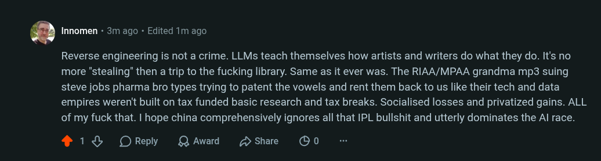

# Public Take transcript

## Machine transcription

. Innomen + 3m ago - Edited 1m ago

Reverse engineering is not a crime. LLMs teach themselves how artists and writers do what they do. It's no
more "stealing" then a trip to the fucking library. Same as it ever was. The RIAA/MPAA grandma mp3 suing
steve jobs pharma bro types trying to patent the vowels and rent them back to us like their tech and data
empires weren't built on tax funded basic research and tax breaks. Socialised losses and privatized gains. ALL
of my fuck that. I hope china comprehensively ignores all that IPL bullshit and utterly dominates the Al race.

418 OReply QAward Hshare OO0
