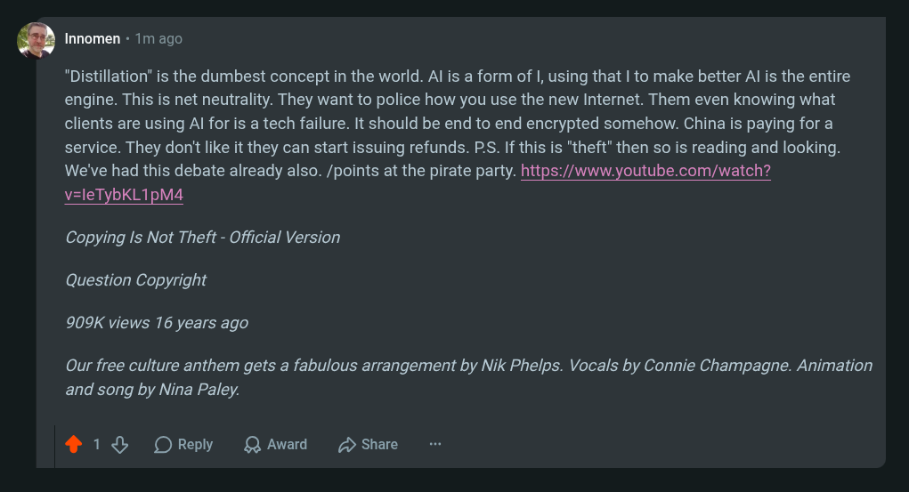

# Public Take transcript

## Machine transcription

g Innomen + 1m ago

"Distillation” is the dumbest concept in the world. Al is a form of |, using that | to make better Al is the entire
engine. This is net neutrality. They want to police how you use the new Internet. Them even knowing what
clients are using Al for is a tech failure. It should be end to end encrypted somehow. China is paying for a
service. They don't like it they can start issuing refunds. PS. If this is "theft" then so is reading and looking.
We've had this debate already also. /points at the pirate party. https://www.youtube.com/watch?

v=leTybKL1pM4

Copying Is Not Theft - Official Version
Question Copyright
909K views 16 years ago

Our free culture anthem gets a fabulous arrangement by Nik Phelps. Vocals by Connie Champagne. Animation
and song by Nina Paley.

418 OReply QAward /2 Share
