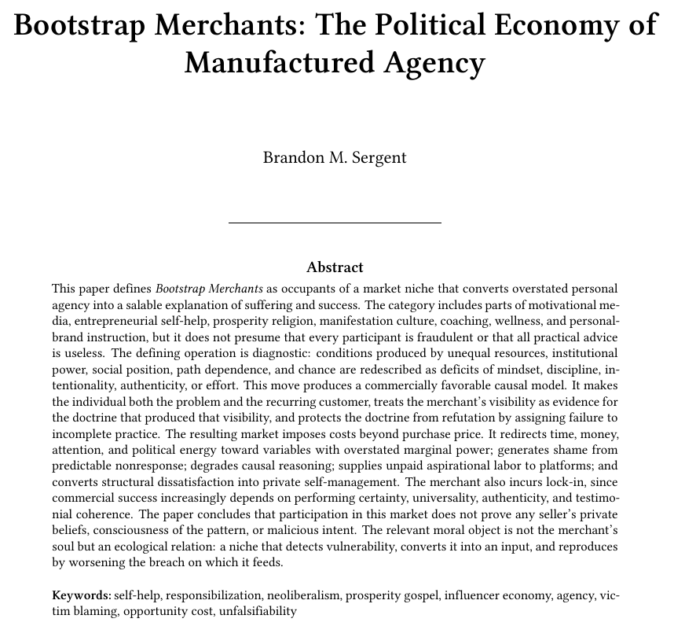

# Public Take transcript

## Machine transcription

Bootstrap Merchants: The Political Economy of
Manufactured Agency

Brandon M. Sergent

Abstract

‘This paper defines Bootstrap Merchants as occupants of a market niche that converts overstated personal
agency into a salable explanation of suffering and success. The category includes parts of motivational me-
dia, entrepreneurial self-help, prosperity religion, manifestation culture, coaching, wellness, and personal-
brand instruction, but it does not presume that every participant is fraudulent or that all practical advice
is useless. The defining operation is diagnostic: conditions produced by unequal resources, institutional
power, social position, path dependence, and chance are redescribed as deficits of mindset, discipline, in-
tentionality, authenticity, or effort. This move produces a commercially favorable causal model. It makes
the individual both the problem and the recurring customer, treats the merchant’s visibility as evidence for
the doctrine that produced that visibility, and protects the doctrine from refutation by assigning failure to
incomplete practice. The resulting market imposes costs beyond purchase price. It redirects time, money,
attention, and political energy toward variables with overstated marginal power; generates shame from
predictable nonresponse; degrades causal reasoning; supplies unpaid aspirational labor to platforms; and
converts structural dissatisfaction into private self-management. The merchant also incurs lock-
and testimo-

n, since
commercial success increasingly depends on performing certainty, universality, authenticit
nial coherence. The paper concludes that participation in this market does not prove any seller’s private
beliefs, consciousness of the pattern, or malicious intent. The relevant moral object is not the merchant’s
soul but an ecological relation: a niche that detects vulnerability, converts it into an input, and reproduces
by worsening the breach on which it feeds.

Keywords: self-help, responsibilization, neoliberalism, prosperity gospel, influencer economy, agency, vie-
tim blaming, opportunity cost, unfalsifiability
