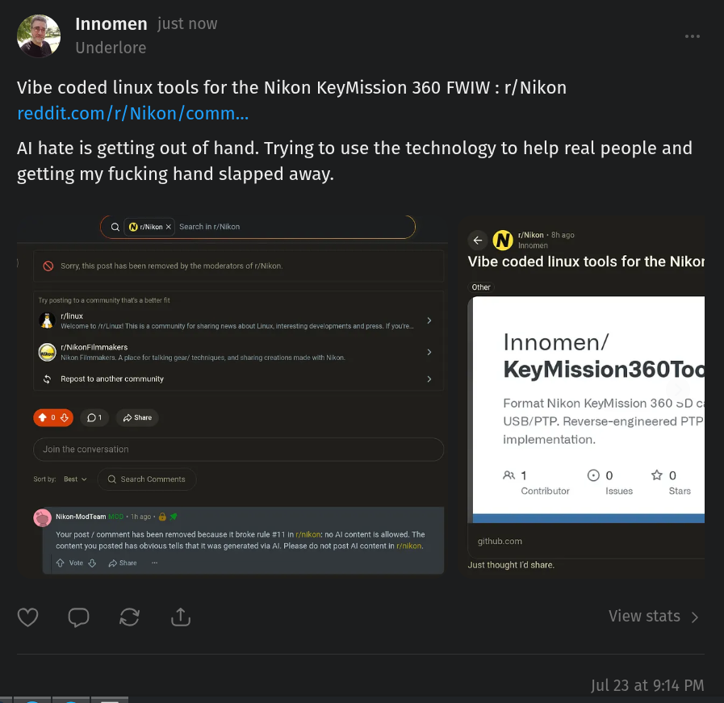

# Public Take transcript

## Machine transcription

‘% Innomen

Vibe coded linux tools for the Nikon KeyMission 360 FWIW : r/Nikon

reddit.com/r/Nikon/comm...

Al hate is getting out of hand. Trying to use the technology to help real people and

getting my fucking hand slapped away.

S :

Vour post/ comment has been removed because It broke rle 711 1 1/nken: 1o Al ontent s allowd, The
content you posted has obvous el hat 1 was generated ia Al Please do ot post Al cantent n /1

O Voo &

Vibe coded linux tools for the Nikor

other

Innomen/
KeyMission360Tod

Just thought d share
