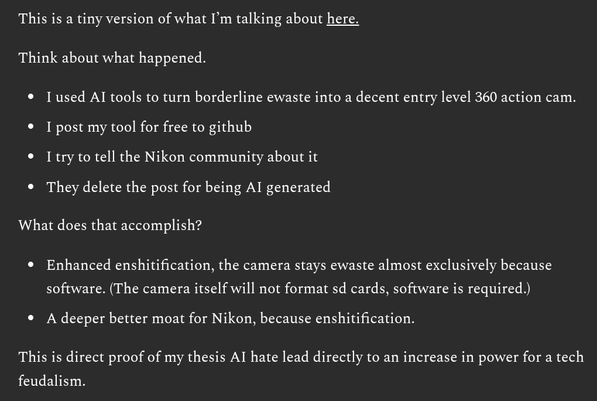

# Public Take transcript

## Machine transcription

This is a tiny version of what I'm talking about here.
Think about what happened.

® Tused Al tools to turn borderline ewaste into a decent entry level 360 action cam.
* [ post my tool for free to github
o 1try to tell the Nikon community about it

® They delete the post for being Al generated

What does that accomplish?

* Enhanced enshitification, the camera stays ewaste almost exclusively because

software. (The camera itself will not format sd cards, software is required.)

o A deeper better moat for Nikon, because enshitification.

This is direct proof of my thesis Al hate lead directly to an increase in power for a tech

feudalism.
