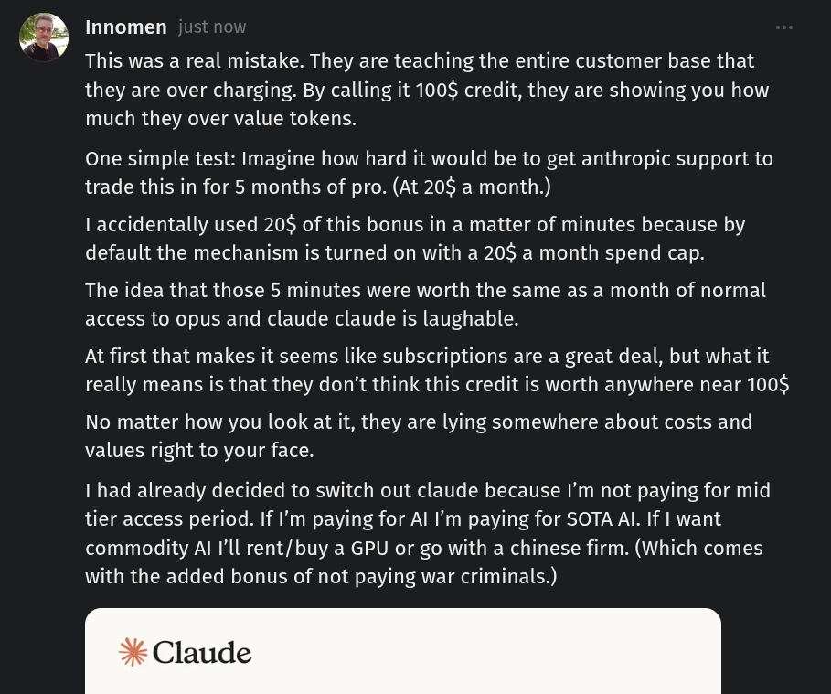

# Public Take transcript

## Machine transcription

% Innomen

This was a real mistake. They are teaching the entire customer base that
they are over charging. By calling it 100$ credit, they are showing you how
much they over value tokens.

One simple test: Imagine how hard it would be to get anthropic support to
trade this in for 5 months of pro. (At 20$ a month.)

1 accidentally used 20$ of this bonus in a matter of minutes because by
default the mechanism is turned on with a 20$ a month spend cap.

The idea that those 5 minutes were worth the same as a month of normal
access to opus and claude claude is laughable.

At first that makes it seems like subscriptions are a great deal, but what it
really means is that they don’t think this credit is worth anywhere near 100$

No matter how you look at it, they are lying somewhere about costs and
values right to your face.

I had already decided to switch out claude because I'm not paying for mid
tier access period. If I'm paying for Al I'm paying for SOTA Al If | want
commodity Al I'll rent/buy a GPU or go with a chinese firm. (Which comes
with the added bonus of not paying war criminals.)

Claude
