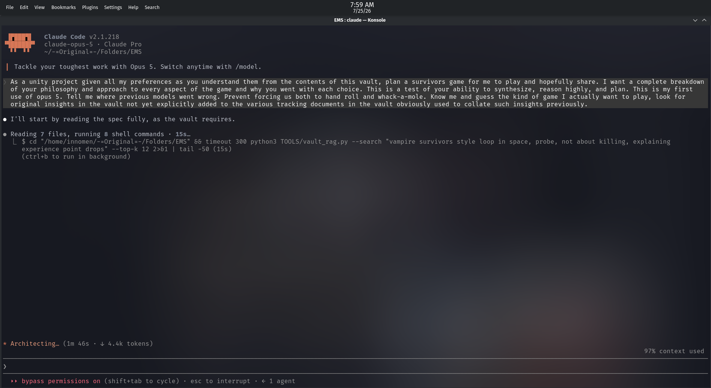

# Public Take transcript

## Machine transcription

it Vi i i 7:59 AM
File Edit View Bookmarks Plugins Settings Help Search o
EMS : claude — Konsole

Claude Code v2.1.218
claude-opus-5 - Claude Pro

~/-=0riginal=-/Folders/EMS

| Tackle your toughest work with Opus 5. Switch anytime with /model.

As a unity project given all my preferences as you understand them from the contents of this vault, plan a survivors game for me to play and hopefully share. I want a complete breakdown
of your philosophy and approach to every aspect of the game and why you went with each choice. This is a test of your ability to synthesize, reason highly, and plan. This is my first

use of opus 5. Tell me where previous models went wrong. Prevent forcing us both to hand roll and whack-a-mole. Know me and guess the kind of game I actually want to play, look for
original insights in the vault not yet explicitly added to the various tracking documents in the vault obviously used to collate such insights previously.

e I'll start by reading the spec fully, as the vault requires.
o Reading 7 files, running & shell commands - 15s..

L $ cd "/home/innomen/-=Original=-/Folders/EMS" &6 timeout 300 python3 TOOLS/vault_rag.py --search "vampire survivors style loop in space, probe, not about killing, explaining
experience point drops" --top-k 12 2>§1 | tail -50 (15s)

(ctrl+b to run in background)

* Architecting.. (1m 46s - 1 4.4k tokens)

97% context used
>

»» bypass permissions on (shift+tab to cycle) - esc to interrupt - ¢« 1 agent
