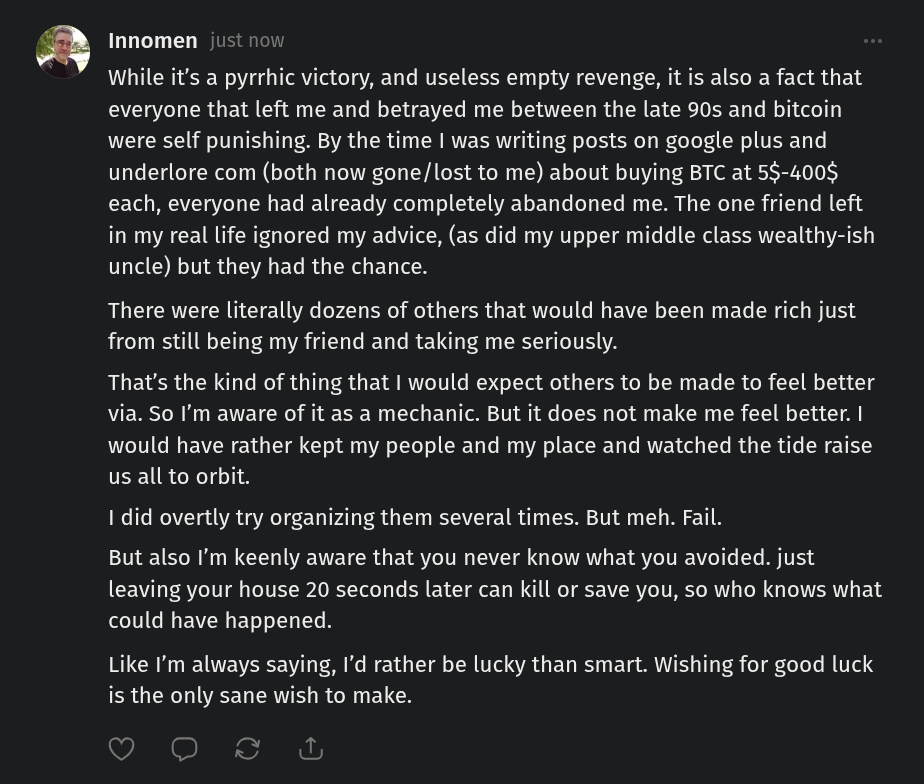

# Public Take transcript

## Machine transcription

3

Innomen just now

While it’s a pyrrhic victory, and useless empty revenge, it is also a fact that
everyone that left me and betrayed me between the late 90s and bitcoin
were self punishing. By the time | was writing posts on google plus and
underlore com (both now gone/lost to me) about buying BTC at 55-400$
each, everyone had already completely abandoned me. The one friend left
in my real life ignored my advice, (as did my upper middle class wealthy-ish
uncle) but they had the chance.

There were literally dozens of others that would have been made rich just
from still being my friend and taking me seriously.

That's the kind of thing that | would expect others to be made to feel better
via. So I'm aware of it as a mechanic. But it does not make me feel better. |
would have rather kept my people and my place and watched the tide raise
us all to orbit.

1 did overtly try organizing them several times. But meh. Fail.

But also I'm keenly aware that you never know what you avoided. just
leaving your house 20 seconds later can kill or save you, so who knows what
could have happened.

Like I'm always saying, I'd rather be lucky than smart. Wishing for good luck
is the only sane wish to make.

(VGRS A
