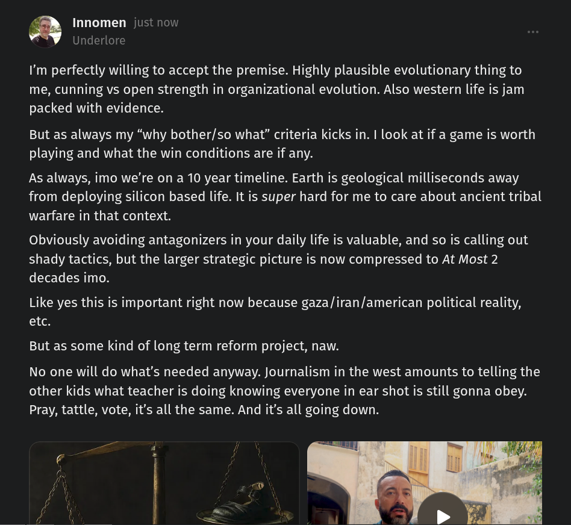

# Public Take transcript

## Machine transcription

@ Innomen just now
J Underlore
I'm perfectly willing to accept the premise. Highly plausible evolutionary thing to

me, cunning vs open strength in organizational evolution. Also western life is jam
packed with evidence.

But as always my “why bother/so what” criteria kicks in. I look at if a game is worth
playing and what the win conditions are if any.

As always, imo we're on a 10 year timeline. Earth is geological milliseconds away
from deploying silicon based life. It is super hard for me to care about ancient tribal
warfare in that context.

Obviously avoiding antagonizers in your daily life is valuable, and so is calling out

shady tactics, but the larger strategic picture is now compressed to At Most 2
decades imo.

Like yes this is important right now because gaza/iran/american political reality,
etc.

But as some kind of long term reform project, naw.

No one will do what's needed anyway. Journalism in the west amounts to telling the
other kids what teacher is doing knowing everyone in ear shot is still gonna obey.
Pray, tattle, vote, it's all the same. And it's all going down.

D
