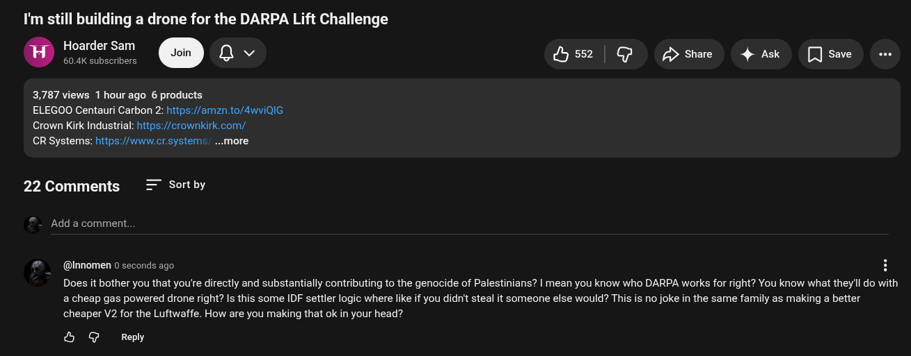

# Public Take transcript

## Machine transcription

I'm still building a drone for the DARPA Lift Challenge

Hoarder Sam
. 60.4K subscribers o Qv fyss2 | G P>shae 4 Ask [ save

3,787 views 1 hourago 6 products

ELEGOO Centauri Carbon 2: https://amzn.to/4wviQlG
Crown Kirk Industrial: https://crownkirk.com/

CR Systems: hittps://wwiw.crsystems. ...more

22 Comments = Sortby

Add a comment.

@Innomen 0 seconds ago

Does it bother you that you're directly and substantially contributing to the genocide of Palestinians? | mean you know who DARPA works for right? You know what they'll do with
a cheap gas powered drone right? Is this some IDF settler logic where like if you didnit steal it someone else would? This is no joke in the same family as making a better
cheaper V2 for the Luftwaffe. How are you making that ok in your head?

& @ Reply
