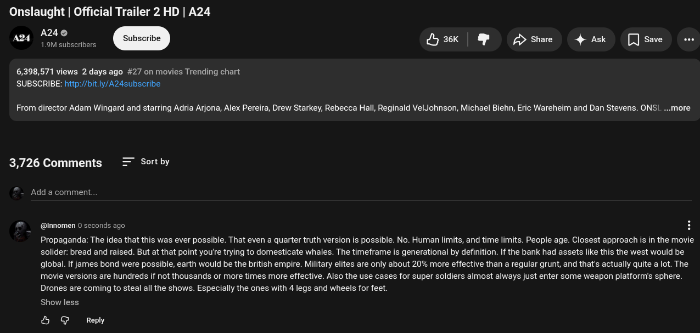

# Public Take transcript

## Machine transcription

Onslaught | Official Trailer 2 HD | A24
anq A240

1.9M subscribers

3k | & Dshae 4 Ak [Jsae e

6,398,571 views 2 days ago #27 on movies Trending chart
'SUBSCRIBE: http://bit.ly/A24subscribe

From director Adam Wingard and starring Adria Arjona, Alex Pereira, Drew Starkey, Rebecca Hall, Reginald VelJohnson, Michael Biehn, Eric Wareheim and Dan Stevens. ONSL. ...more

3,726 Comments = Sortby

Add a comment.

@Innomen 0 seconds ago H
Propaganda: The idea that this was ever possible. That even a quarter truth version is possible. No. Human limits, and time limits. People age. Closest approach s in the movie
solider: bread and raised. But at that point you're trying to domesticate whales. The timeframe is generational by definition. If the bank had assets like this the west would be
global. If james bond were possible, earth would be the british empire. Military elites are only about 20% more effective than a regular grunt, and that's actually quite a lot. The
movie versions are hundreds if not thousands or more times more effective. Also the use cases for super soldiers almost always just enter some weapon platformis sphere.
Drones are coming to steal all the shows. Especially the ones with 4 legs and wheels for feet.

Show less

& @ Reply
