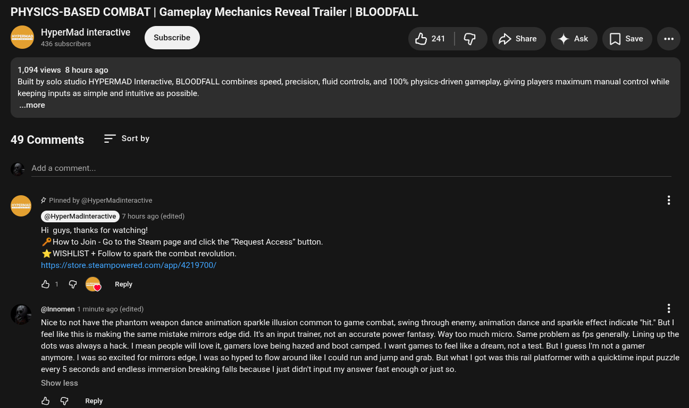

# Public Take transcript

## Machine transcription

PHYSICS-BASED COMBAT | Gameplay Mechanics Reveal Trailer | BLOODFALL

HyperMad interactive
‘ 436 subscribers Subscribe A | G > Share 4 Ask  []save e

1,094 views 8 hours ago

Built by solo studio HYPERMAD Interactive, BLOODFALL combines speed, precision, fluid controls, and 100% physics-driven gameplay, giving players maximum manual control while
keeping inputs as simple and intuitive as possible.

~.more

49 Comments = Sortby

Add a comment.

. # Pinned by @HyperMadinteractive
7 hours ago (edited)
Hi guys, thanks for watching!
/#How to Join - Go to the Steam page and click the "Request Access” button.
& WISHLIST + Follow to spark the combat revolution.
https://store.steampowered.com/app/4219700/

[l 9. Reply

@innomen 1 minute ago (edited)

Nice to not have the phantom weapon dance animation sparkle illusion common to game combat, swing through enemy, animation dance and sparkle effect indicate "hit." But |
feel like this is making the same mistake mirrors edge did. It's an input trainer, not an accurate power fantasy. Way too much micro. Same problem as fps generally. Lining up the
dots was always a hack. | mean people will love it, gamers love being hazed and boot camped. | want games to feel like a dream, not a test. But | guess I'm not a gamer
anymore. | was so excited for mirrors edge, | was so hyped to flow around like | could run and jump and grab. But what | got was this rail platformer with a quicktime input puzzle
every 5 seconds and endless immersion breaking falls because | just didn't input my answer fast enough or just so.

Show less

& & Reply
