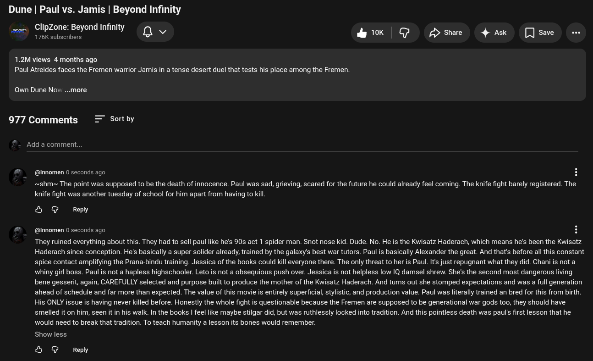

# Public Take transcript

## Machine transcription

Dune | Paul vs. Jamis | Beyond Infinity

ClipZone: Beyond Infinif
R e YoQv &K | G Dshae 4 Ak []sae 5

1.2M views 4 months ago
Paul Atreides faces the Fremen warrior Jamis in a tense desert duel that tests his place among the Fremen.

Own Dune Nov. ...more

977 Comments

Sort by

Add a comment.

@nnomen 0 seconds ago H

~shm~ The point was supposed to be the death of innocence. Paul was sad, grieving, scared for the future he could already feel coming. The knife fight barely registered. The
knife fight was another tuesday of school for him apart from having to kill.

& @ Reply

@nnomen 0 seconds ago H

They ruined everything about this. They had to sell paul like he's 90s act 1 spider man. Snot nose kid. Dude. No. He is the Kwisatz Haderach, which means he's been the Kwisatz
Haderach since conception. He's basically a super solider already, trained by the galaxy's best war tutors. Paul is basically Alexander the great. And that's before all this constant
spice contact amplifying the Prana-bindu training. Jessica of the books could kill everyone there. The only threat to her is Paul. It's just repugnant what they did. Chani s not a
whiny girl boss. Paul is not a hapless highschooler. Leto is not a obsequious push over. Jessica is not helpless low IQ damsel shrew. She's the second most dangerous living
bene gesserit, again, CAREFULLY selected and purpose built to produce the mother of the Kwisatz Haderach. And tums out she stomped expectations and was a full generation
ahead of schedule and far more than expected. The value of this movie is entirely superficial, stylistic, and production value. Paul was literally trained an bred for this from birth.
His ONLY issue is having never killed before. Honestly the whole fight is questionable because the Fremen are supposed to be generational war gods too, they should have
smelled it on him, seen it in his walk. In the books | feel like maybe stilgar did, but was ruthlessly locked into tradition. And this pointless death was paul's first lesson that he
would need to break that tradition. To teach humanity a lesson its bones would remember.

Show less

& @ Reply
